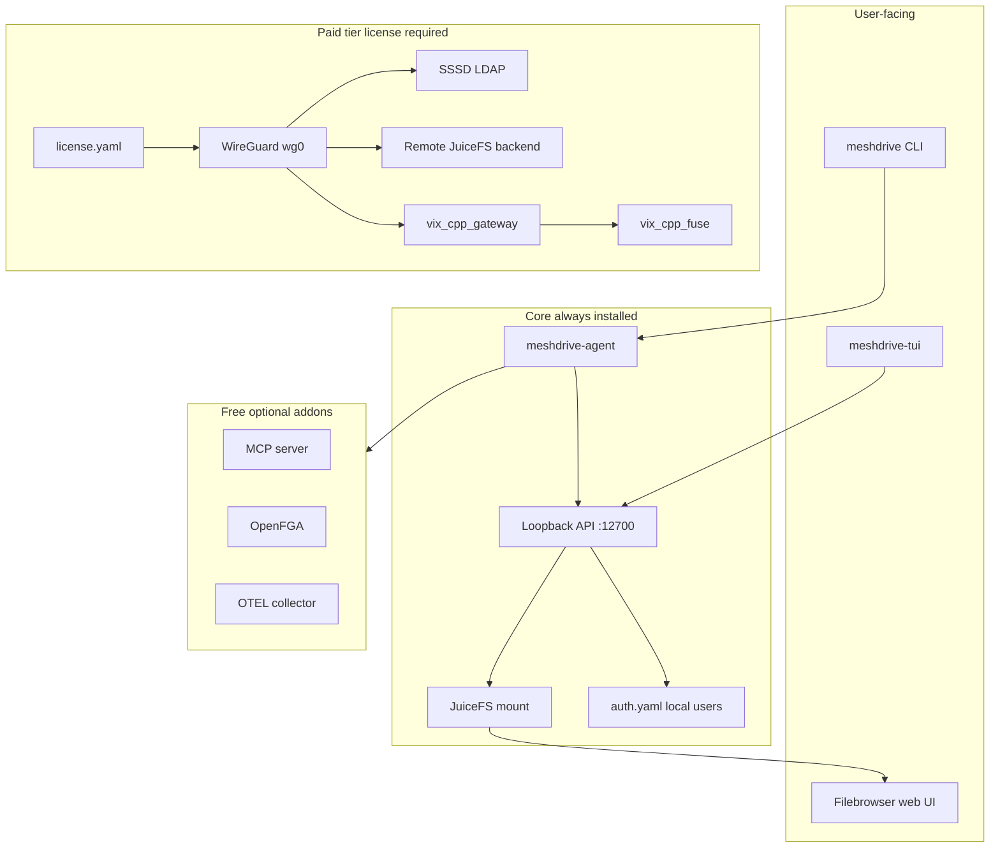

# Architecture

MeshDrive 2.0 runs entirely on a Linux host. The design goal is **local-first**: metadata and object data live on the machine by default; remote cluster features are optional, license-gated, and reachable only over WireGuard.

## High-level diagram



## Components

### `meshdrive-agent`

Systemd daemon that:

- Serves a **loopback-only** JSON HTTP API on `127.0.0.1:12700`
- Periodically refreshes `/opt/meshdrive/var/state.json` (mount status, binaries, addon progress)
- Orchestrates storage mount/unmount via systemd template units `meshdrive-mount@<name>.service`
- Starts Filebrowser after a successful mount

Implementation: `src/meshdrive/agent/` (`daemon.py`, `api.py`, `health.py`, `systemd.py`).

### `meshdrive-tui`

Textual terminal UI that talks to the agent API. Tabs: Dashboard, Storage, Users, Add-ons, Settings.

Implementation: `src/meshdrive/tui/`.

### Unified CLI (`meshdrive`)

Single entry point for status, diagnostics, license, addons, WireGuard, and cluster configuration.

Implementation: `src/meshdrive/cli/`.

### JuiceFS + local storage

Each backend is a JuiceFS volume with:

- **Metadata:** SQLite at `$ROOT/var/meta/<name>.db`
- **Object store:** local directory (`file://`) at `$ROOT/var/data/<name>` or a user-chosen path
- **Mount:** `$ROOT/mnt/<name>`

Formatting and mount are triggered by the TUI or agent API; the mount unit runs `juicefs mount` with FUSE `allow_other` so the `meshdrive` user (Filebrowser) can read files.

Implementation: `src/meshdrive/storage/juicefs.py`, `mount.py`.

### Filebrowser

Pinned binary served on **127.0.0.1:8080** only. Database and config live under `$ROOT/var/` and `$ROOT/etc/`.

### Local authentication

Users and argon2id password hashes in `$ROOT/etc/auth.yaml`. User administration is **not** exposed via MCP.

Implementation: `src/meshdrive/auth/local.py`.

## Isolation model

All MeshDrive **configuration, secrets, logs, databases, and MCP-visible files** stay under a single install root:

| Install | Root |
|---------|------|
| `.deb` / `install.sh` | `/opt/meshdrive` |
| Snap | `$SNAP_COMMON` (e.g. `/var/snap/meshdrive/common`) |
| Dev | `$MESHDRIVE_ROOT` |

Override with environment variable `MESHDRIVE_ROOT`.

`src/meshdrive/paths.py` enforces MCP access against `isolation.allowed_paths` in `config.yaml` (default: the install root only). The installer does **not** write to `$HOME/.config/meshdrive`.

**Host paths outside the root** (by design):

| Path | When |
|------|------|
| `/etc/systemd/system/meshdrive-*.service` | Always |
| `/usr/local/bin/meshdrive*` | `.deb` / install.sh |
| `/etc/fuse.conf` | `user_allow_other` if commented |
| `/etc/wireguard/wg0.conf` | Paid WireGuard apply |
| `/etc/sssd/sssd.conf` | Paid cluster configure |
| `/etc/nftables.d/meshdrive-wg-client.nft` | Paid WireGuard apply |

## Directory layout

```
$ROOT/
  bin/           juicefs, filebrowser, meshdrive-*, optional vix/openfga/otel
  etc/           config.yaml, auth.yaml, license.yaml, addon configs
  var/           state.json, meta/, data/, cache/, log/, addon DBs
  mnt/           JuiceFS mount points
  share/         wireguard templates (wg0.conf.template, nft-client.nft)
  venv/          Python virtualenv (production install)
  pkg/           Python sources (deb/snap layout)
  systemd/       unit file copies
```

## State and configuration

| File | Purpose |
|------|---------|
| `etc/config.yaml` | Primary config: backends, filebrowser, addon status, isolation |
| `etc/auth.yaml` | Local user credentials |
| `etc/license.yaml` | Paid tier activation (created by `meshdrive license activate`) |
| `etc/cluster.yaml` | Paid remote LDAP/JuiceFS settings |
| `var/state.json` | Live snapshot for TUI/dashboard (written by agent) |

Config merge logic preserves defaults for missing keys (`src/meshdrive/config.py`).

## Systemd units

| Unit | Role |
|------|------|
| `meshdrive-agent.service` | Agent daemon |
| `meshdrive-mount@.service` | Per-backend JuiceFS mount |
| `meshdrive-filebrowser.service` | Web UI |
| `meshdrive-mcp.service` | MCP SSE on loopback (addon) |
| `meshdrive-openfga.service` | Authorization server (addon) |
| `meshdrive-otel.service` | Telemetry collector (addon) |
| `meshdrive-vix-gateway.service` | QUIC gateway (paid addon) |
| `meshdrive-vix-fuse.service` | Remote FUSE (paid addon) |
| `wg-quick@wg0.service` | WireGuard tunnel (host, paid) |

## Packaging

| Method | Audience | Notes |
|--------|----------|-------|
| **Snap** (classic) | End users | Primary; `$SNAP_COMMON` data dir |
| **`.deb`** (nfpm) | Dev / enterprise | Full tree under `/opt/meshdrive` |
| **`install.sh`** | Git checkout | Same as deb without package manager |

See [installation.md](installation.md).

## Comparison with MeshDrive 2.1.0

The legacy package in `package/meshdrive-dev-local/` (`meshdrive-agent`) targets a **centralized** model: ZeroTier overlay, remote TiKV, remote LDAP from first boot. MeshDrive 2.0 inverts that: local sqlite by default, WireGuard-only remote path, no ZeroTier. **Do not install both on the same host** — they both expect `/opt/meshdrive` as the root.
