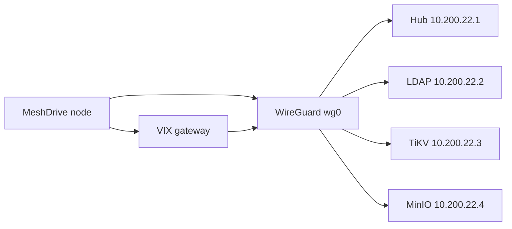

# Paid cluster

The paid cluster stack connects a MeshDrive node to **remote identity and storage** over WireGuard. Local sqlite JuiceFS remains the default; remote resources are **additional** backends — free-tier data is never auto-uploaded.

## Prerequisites

1. [License activated](licensing.md)
2. [WireGuard tunnel up](wireguard.md) (`wg show` OK, hub reachable)
3. Add-ons installed:

```bash
sudo meshdrive addons install sssd-ldap remote-cluster
```

## Architecture



All remote endpoints use **inner overlay IPs or internal DNS names** resolved by hub DNS — not public internet addresses.

## Cluster configure

Single command writes SSSD config, `cluster.yaml`, and optional remote JuiceFS backend:

```bash
sudo meshdrive cluster configure \
  --ldap-url ldap://ldap.internal.example \
  --ldap-base dc=meshdrive,dc=local \
  --bind-dn "cn=readonly,dc=meshdrive,dc=local" \
  --bind-password 'secret' \
  --metadata-url tikv://10.200.22.3:2379/volume \
  --object-endpoint http://10.200.22.4:9000 \
  --backend-name remote
```

Check result:

```bash
meshdrive cluster status
cat /opt/meshdrive/etc/cluster.yaml
grep -A20 backends /opt/meshdrive/etc/config.yaml
```

### What it configures

| Component | Output |
|-----------|--------|
| SSSD | `/etc/sssd/sssd.conf` (mode 600), `systemctl restart sssd` |
| Cluster metadata | `$ROOT/etc/cluster.yaml` |
| Auth mode | `config.yaml` → `auth.backend: sssd` |
| Remote backend | New entry in `storage.backends` with `type: juicefs-remote` |
| Mode | `meshdrive.mode: hybrid` |

LDAP URL examples (must resolve inside WG):

- `ldap://ldap.internal.example`
- `ldap://10.200.22.2`

## VIX connectivity (optional)

For QUIC/HTTP3 remote POSIX access:

```bash
meshdrive addons install vix-gateway
meshdrive addons install vix-fuse
```

### VIX gateway

- Binary: `$ROOT/bin/vix_cpp_gateway` (build via `packaging/build-vix.sh`)
- Serves local mount: `--storage $ROOT/mnt/primary --host 127.0.0.1 --port 9443`
- Unit: `meshdrive-vix-gateway.service`
- Env: `etc/vix-gateway.env` (control channel options for remote management)

Smoke test:

```bash
curl -k https://127.0.0.1:9443/health
```

### VIX FUSE

- Binary: `$ROOT/bin/vix_cpp_fuse`
- Config: `etc/vix-fuse-backends.json` — gateway URLs must be **inside WG**

Example backend entry:

```json
{
  "name": "remote-primary",
  "gateway": "https://10.200.22.10:9443",
  "mountpoint": "/opt/meshdrive/mnt/vix-remote"
}
```

Requires WireGuard up; unit: `meshdrive-vix-fuse.service`.

Build from source: [`vix_package/cpp_gateway/`](../../vix_package/cpp_gateway/), [`vix_package/cpp_fuse/`](../../vix_package/cpp_fuse/).

## Sync policy

| Backend | Metadata | When used |
|---------|----------|-----------|
| `primary` (local) | SQLite on device | Default; always available offline |
| `remote` (paid) | TiKV over WG | Optional second mount; manual/policy-driven |

There is no automatic bidirectional sync in 2.0.0 — operators choose which backend to mount and expose via Filebrowser/MCP.

## End-to-end staging checklist

```bash
meshdrive license activate --token "$TOKEN"
sudo meshdrive wireguard bootstrap
sudo meshdrive wireguard apply --file ./customer-wg0.conf
sudo meshdrive wireguard up
ping -c2 10.200.22.1

sudo meshdrive addons install sssd-ldap remote-cluster
sudo meshdrive cluster configure --ldap-url ldap://ldap.internal.example ...

meshdrive addons install vix-gateway vix-fuse
# mount remote backend via TUI or juicefs CLI
# read file through FUSE mount
```

See [TESTING.md](TESTING.md) section F.

## Security notes

- LDAP bind credentials in `cluster configure` are written to `/etc/sssd/sssd.conf` (0600)
- Remote object storage is not exposed on the public internet
- VIX gateway binds loopback by default; remote access is via WG inner IPs only

## Implementation

- `src/meshdrive/cluster/configure.py` — SSSD + config wizard
- `src/meshdrive/addons/install.py` — `sssd-ldap`, `remote-cluster`, `vix-gateway`, `vix-fuse` installers
